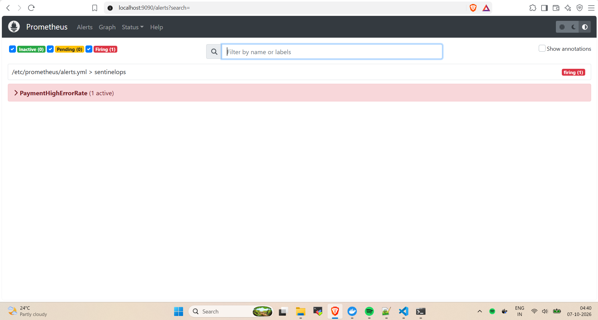
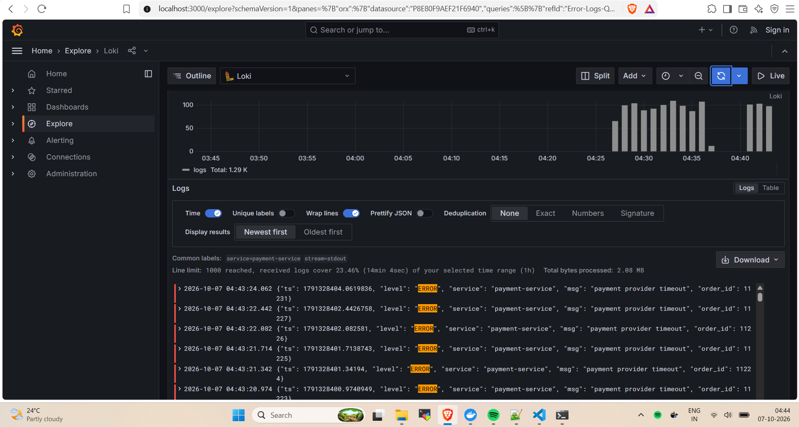
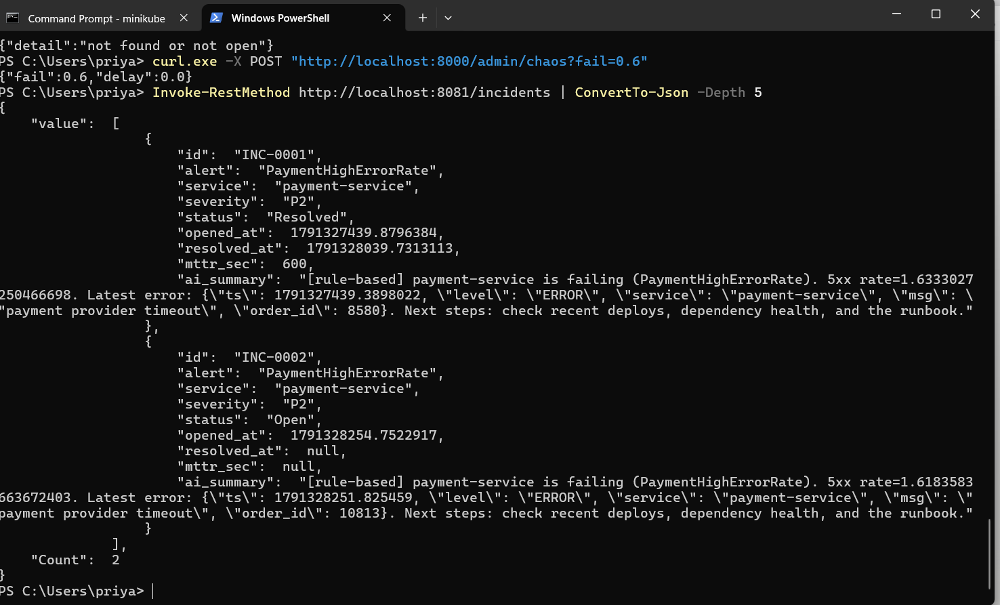
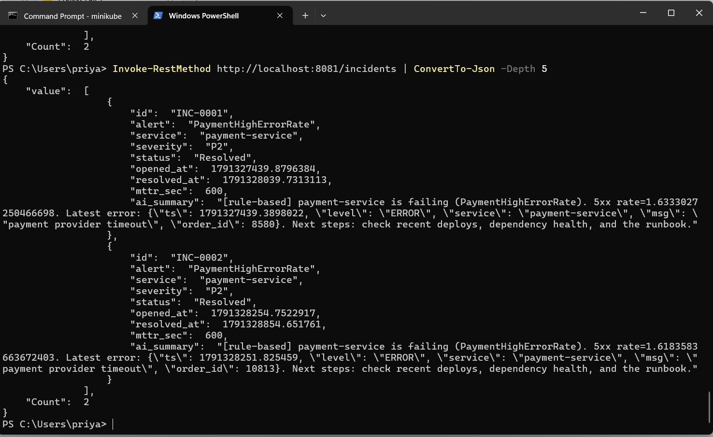
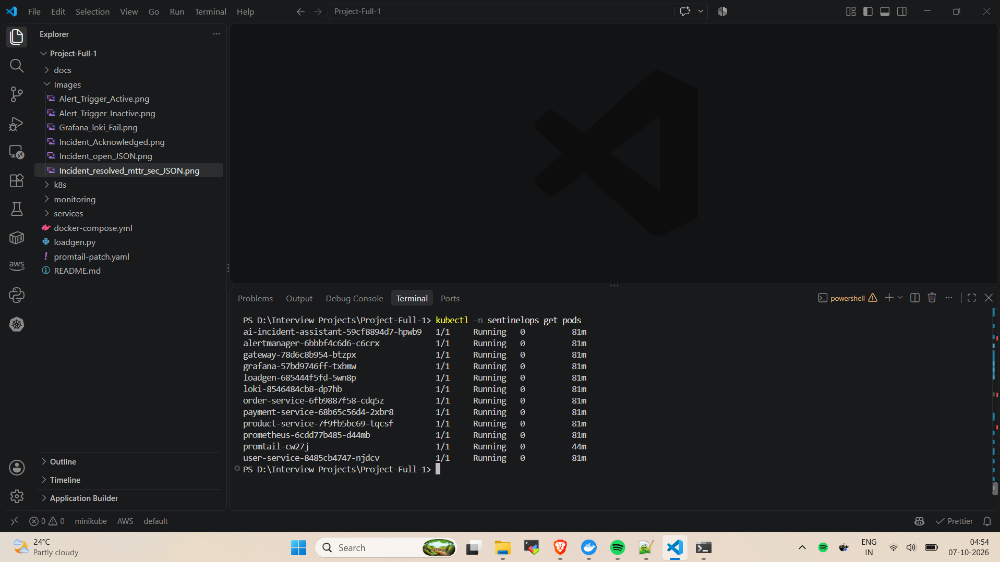
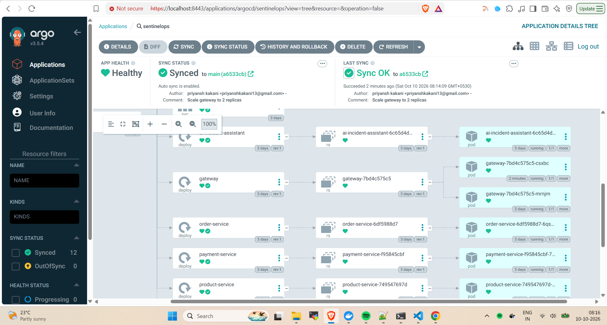
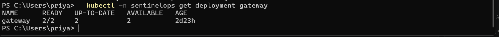
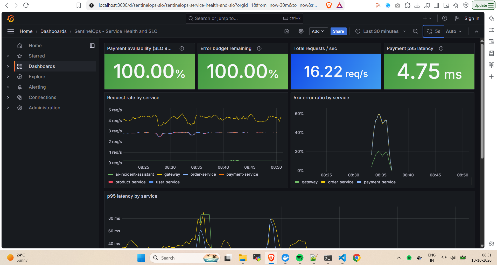
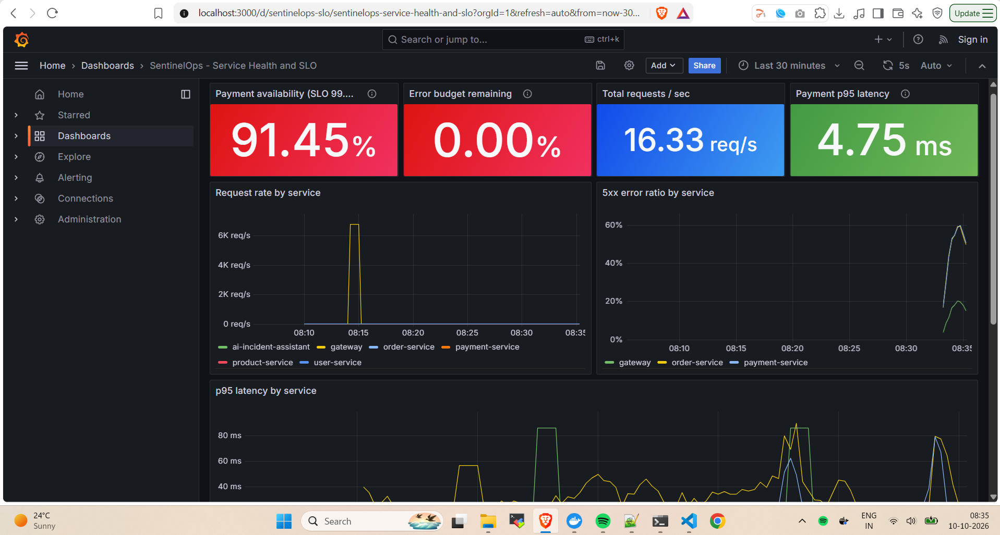
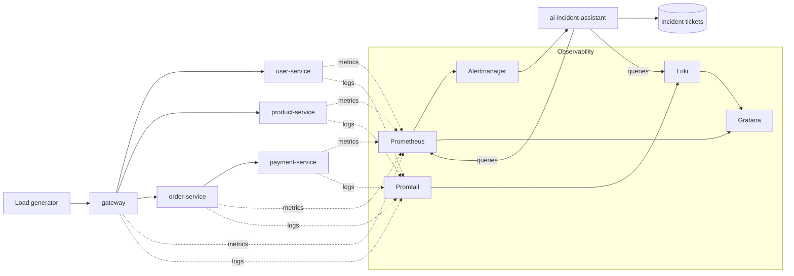

# SentinelOps


A microservices platform on Kubernetes with full observability (Prometheus, Grafana, Loki) and an AI-assisted incident workflow. When something breaks, an alert fires, a ticket is created automatically with a root-cause summary, MTTR is tracked, and the ticket resolves itself when the system recovers.

> Personal lab project built to practice the full DevOps lifecycle: deploy, observe, break, detect, respond, recover.

## Screenshots

### 1. Alert firing in Prometheus



### 2. Error logs in Grafana (Loki)



### 3. AI-generated incident ticket (Open)



### 4. Incident resolved with MTTR



### 5. All pods running on Kubernetes



## GitOps with ArgoCD

Deployments are driven by Git. ArgoCD watches this repo and keeps the cluster in sync
with the Helm chart in `helm/sentinelops`.



**Proof of the loop:** I changed `replicas: 2` for the gateway in `values.yaml` and pushed.
ArgoCD deployed it with no manual commands. When I scaled the gateway down by hand with
`kubectl`, ArgoCD detected the drift and restored 2 replicas (self-heal).



## Dashboard and SLO

A Grafana dashboard (`monitoring/grafana/dashboards/sentinelops.json`) tracks service health and
a reliability target for payments: **99.5% of requests succeed**. The remaining 0.5% is the
error budget. During a fault, availability drops below target and the budget burns down.

### Healthy system



### During a payment fault



Import it in Grafana: Dashboards, New, Import, upload the JSON, select Prometheus and Loki.

## Architecture



## How the incident flow works

1. A fault is injected into `payment-service` (a chaos endpoint makes a percentage of payments fail).
2. Services expose Prometheus metrics; Prometheus detects the error rate is above 20% for 20 seconds and fires `PaymentHighErrorRate`.
3. Alertmanager sends a webhook to `ai-incident-assistant`.
4. The assistant pulls recent error logs from Loki and the 5xx rate from Prometheus, then asks an LLM (Claude) for a summary, likely root cause and next steps. Without an API key it falls back to a rule-based summary.
5. It creates an incident ticket (`INC-0001`, severity, status, timestamps) and optionally posts to Slack.
6. An engineer acknowledges the ticket. When the fault is fixed, the alert resolves and the ticket closes with **MTTR** recorded.

## Tech stack

| Area                 | Tools                                 |
| -------------------- | ------------------------------------- |
| Services             | Python, FastAPI                       |
| Containers           | Docker (non-root images)              |
| Orchestration        | Kubernetes (minikube)                 |
| Metrics and alerting | Prometheus, Alertmanager              |
| Logging              | Loki, Promtail                        |
| Dashboards           | Grafana                               |
| AI                   | Anthropic Claude API (optional)       |
| Load / fault testing | Python load generator, chaos endpoint |

## Repository layout

```
sentinelops/
├── services/            # 5 microservices + AI incident assistant (one shared Dockerfile)
├── monitoring/          # Prometheus, alert rules, Alertmanager, Promtail, Grafana configs
├── k8s/                 # Kubernetes manifests
├── docs/runbooks/       # Runbook linked from the alert
├── images/              # Screenshots used in this README
├── docker-compose.yml   # Quick local run without Kubernetes
└── loadgen.py           # Generates steady traffic
```

## Run with Docker Compose (quickest)

Requires Docker.

```bash
docker compose up --build -d
```

| URL                             | What               |
| ------------------------------- | ------------------ |
| http://localhost:8000/docs      | Gateway API        |
| http://localhost:3000           | Grafana (no login) |
| http://localhost:9090           | Prometheus         |
| http://localhost:9093           | Alertmanager       |
| http://localhost:8080/incidents | Incident tickets   |

## Run on minikube (Windows PowerShell)

Requires Docker Desktop, minikube and kubectl.

```powershell
# 1. Start the cluster
minikube start --driver=docker --memory=4096 --cpus=2

# 2. Build the images and load them into minikube
$services = "gateway","user-service","product-service","order-service","payment-service","ai-incident-assistant"
foreach ($s in $services) {
  docker build -q -t sentinelops/${s}:latest --build-arg SERVICE=$s ./services
  minikube image load sentinelops/${s}:latest
}

# 3. Create the namespace and config maps
kubectl create namespace sentinelops
kubectl -n sentinelops create configmap prometheus-config --from-file=monitoring/prometheus.yml --from-file=monitoring/alerts.yml
kubectl -n sentinelops create configmap alertmanager-config --from-file=monitoring/alertmanager.yml
kubectl -n sentinelops create configmap grafana-ds --from-file=monitoring/grafana/datasources.yml
kubectl -n sentinelops create configmap promtail-config --from-file=monitoring/promtail-k8s.yml
kubectl -n sentinelops create configmap loadgen --from-file=loadgen.py

# 4. Deploy and wait for all pods to be Running
kubectl apply -f k8s/sentinelops.yaml
kubectl -n sentinelops get pods -w
```

Open the port-forwards (one window each):

```powershell
Start-Process powershell -ArgumentList "-NoExit","-Command","kubectl -n sentinelops port-forward svc/gateway 8000:8000"
Start-Process powershell -ArgumentList "-NoExit","-Command","kubectl -n sentinelops port-forward svc/grafana 3000:3000"
Start-Process powershell -ArgumentList "-NoExit","-Command","kubectl -n sentinelops port-forward svc/prometheus 9090:9090"
Start-Process powershell -ArgumentList "-NoExit","-Command","kubectl -n sentinelops port-forward svc/ai-incident-assistant 8081:8000"
```

The incident list is then at http://localhost:8081/incidents (8081 is used because 8080 can be taken by other software).

Optional: set `ANTHROPIC_API_KEY` as a Kubernetes Secret named `ai-keys` for real AI summaries. Never commit the key to Git.

## Demo: break it and watch it recover

```powershell
# 1. Make 60% of payments fail
curl.exe -X POST "http://localhost:8000/admin/chaos?fail=0.6"

# 2. After ~1 minute: alert is firing at http://localhost:9090/alerts
#    and the ticket exists:
Invoke-RestMethod http://localhost:8081/incidents | ConvertTo-Json -Depth 5

# 3. Acknowledge the incident
curl.exe -X POST http://localhost:8081/incidents/INC-0001/ack

# 4. Fix the fault, the incident auto-resolves with MTTR
curl.exe -X POST "http://localhost:8000/admin/chaos?fail=0"
```

Useful queries:

- Loki (Grafana, Explore): `{service="payment-service"} |= "ERROR"`
- Prometheus: `sum(rate(http_requests_total[1m])) by (service)`

## Troubleshooting notes (problems I hit and fixed)

| Problem                                | Cause                                                                                                                | Fix                                                                   |
| -------------------------------------- | -------------------------------------------------------------------------------------------------------------------- | --------------------------------------------------------------------- |
| `minikube docker-env` fails on Windows | Cluster uses the containerd runtime                                                                                  | Build with Docker, then `minikube image load`                         |
| Grafana shows no Loki labels           | Promtail found 0 targets: inside a pod `HOSTNAME` is the pod name, so it filtered pods by a node that does not exist | Set `HOSTNAME` from `spec.nodeName` using the Kubernetes downward API |
| `port-forward` fails on 8080           | Port already used by another Windows service                                                                         | Forward to local port 8081 instead                                    |

## Roadmap

- [x] 5 microservices with structured logs and Prometheus metrics
- [x] Kubernetes deployment on minikube
- [x] Metrics, logs, alert rules and Alertmanager routing
- [x] AI incident assistant with ticket lifecycle and MTTR
- [ ] GitHub Actions CI: lint, tests, image build, Trivy scan
- [ ] Helm charts
- [ ] GitOps with ArgoCD
- [ ] Terraform for cloud infrastructure
- [ ] Canary releases with Argo Rollouts
- [ ] Jira / ServiceNow ticket integration
- [ ] Grafana dashboards and SLO tracking
